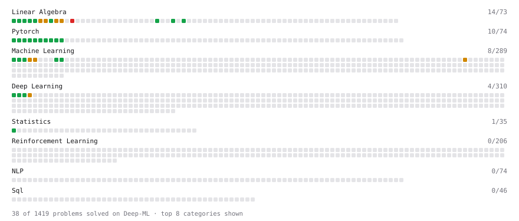

# Deep-ML

My machine learning practice from [Deep-ML](https://www.deep-ml.com). Every solution here was written by hand.

**55** solved · 51 problems · 2 labs · 2 math

[**Browse the interactive portfolio**](https://negareri.github.io/deep-ml/) to replay this filling in over time.

## Problems

| | Difficulty | Solved | |
| --- | --- | --- | --- |
| [Add a Bias Vector to a Batch via Broadcasting](https://www.deep-ml.com/problems/882) | easy | 2026-08-07 | [solution](problems/0882-add-a-bias-vector-to-a-batch-via-broadcasting) |
| [Apply Zero Padding to an Image](https://www.deep-ml.com/problems/239) | easy | 2026-08-26 | [solution](problems/0239-apply-zero-padding-to-an-image) |
| [Backprop a Linear Layer by Hand](https://www.deep-ml.com/problems/898) | easy | 2026-08-07 | [solution](problems/0898-backprop-a-linear-layer-by-hand) |
| [Batch Iterator for Dataset](https://www.deep-ml.com/problems/30) | easy | 2026-08-13 | [solution](problems/0030-batch-iterator-for-dataset) |
| [Build a Linear Regression Model with nn.Module](https://www.deep-ml.com/problems/885) | easy | 2026-08-07 | [solution](problems/0885-build-a-linear-regression-model-with-nn-module) |
| [Build an MLP with nn.Sequential](https://www.deep-ml.com/problems/887) | easy | 2026-08-07 | [solution](problems/0887-build-an-mlp-with-nn-sequential) |
| [Calculate 2x2 Matrix Inverse](https://www.deep-ml.com/problems/8) | easy | 2026-08-11 | [solution](problems/0008-calculate-2x2-matrix-inverse) |
| [Calculate Accuracy Score](https://www.deep-ml.com/problems/36) | easy | 2026-09-05 | [solution](problems/0036-calculate-accuracy-score) |
| [Calculate Covariance Matrix](https://www.deep-ml.com/problems/10) | easy | 2026-08-05 | [solution](problems/0010-calculate-covariance-matrix) |
| [Calculate Image Brightness](https://www.deep-ml.com/problems/70) | easy | 2026-08-25 | [solution](problems/0070-calculate-image-brightness) |
| [Calculate Mean by Row or Column](https://www.deep-ml.com/problems/4) | easy | 2026-08-06 | [solution](problems/0004-calculate-mean-by-row-or-column) |
| [Compute a Gradient with PyTorch Autograd](https://www.deep-ml.com/problems/884) | easy | 2026-08-07 | [solution](problems/0884-compute-a-gradient-with-pytorch-autograd) |
| [Compute Multi-class Cross-Entropy Loss](https://www.deep-ml.com/problems/134) | easy | 2026-09-17 | [solution](problems/0134-compute-multi-class-cross-entropy-loss) |
| [Compute PSNR for Image Reconstruction Quality](https://www.deep-ml.com/problems/713) | easy | 2026-09-05 | [solution](problems/0713-compute-psnr-for-image-reconstruction-quality) |
| [Compute the Cross Product of Two 3D Vectors](https://www.deep-ml.com/problems/118) | easy | 2026-07-26 | [solution](problems/0118-compute-the-cross-product-of-two-3d-vectors) |
| [Convert RGB Image to Grayscale](https://www.deep-ml.com/problems/237) | easy | 2026-08-25 | [solution](problems/0237-convert-rgb-image-to-grayscale) |
| [Convert Vector to Diagonal Matrix](https://www.deep-ml.com/problems/35) | easy | 2026-08-26 | [solution](problems/0035-convert-vector-to-diagonal-matrix) |
| [Create a Float Tensor from a Python List](https://www.deep-ml.com/problems/880) | easy | 2026-08-07 | [solution](problems/0880-create-a-float-tensor-from-a-python-list) |
| [Derivative of a Polynomial](https://www.deep-ml.com/problems/116) | easy | 2026-07-26 | [solution](problems/0116-derivative-of-a-polynomial) |
| [Dot Product Calculator](https://www.deep-ml.com/problems/83) | easy | 2026-07-26 | [solution](problems/0083-dot-product-calculator) |
| [Feature Scaling Implementation](https://www.deep-ml.com/problems/16) | easy | 2026-07-29 | [solution](problems/0016-feature-scaling-implementation) |
| [Flip an Image Horizontally or Vertically](https://www.deep-ml.com/problems/238) | easy | 2026-08-26 | [solution](problems/0238-flip-an-image-horizontally-or-vertically) |
| [Grayscale Image Contrast Calculator](https://www.deep-ml.com/problems/82) | easy | 2026-08-25 | [solution](problems/0082-grayscale-image-contrast-calculator) |
| [Implement a Linear Layer Forward Pass with Matrix Multiplication](https://www.deep-ml.com/problems/883) | easy | 2026-08-07 | [solution](problems/0883-implement-a-linear-layer-forward-pass-with-matrix-multiplication) |
| [Linear Regression Using Gradient Descent](https://www.deep-ml.com/problems/15) | easy | 2026-08-06 | [solution](problems/0015-linear-regression-using-gradient-descent) |
| [Linear Regression Using Normal Equation](https://www.deep-ml.com/problems/14) | easy | 2026-08-04 | [solution](problems/0014-linear-regression-using-normal-equation) |
| [Matrix-Vector Dot Product](https://www.deep-ml.com/problems/1) | easy | 2026-08-05 | [solution](problems/0001-matrix-vector-dot-product) |
| [One-Hot Encoding of Nominal Values](https://www.deep-ml.com/problems/34) | easy | 2026-09-05 | [solution](problems/0034-one-hot-encoding-of-nominal-values) |
| [Random Shuffle of Dataset](https://www.deep-ml.com/problems/29) | easy | 2026-08-13 | [solution](problems/0029-random-shuffle-of-dataset) |
| [Reshape and Transpose a Tensor](https://www.deep-ml.com/problems/881) | easy | 2026-08-07 | [solution](problems/0881-reshape-and-transpose-a-tensor) |
| [Reshape Matrix](https://www.deep-ml.com/problems/3) | easy | 2026-08-06 | [solution](problems/0003-reshape-matrix) |
| [Run One Training Step: Forward, Loss, Backward, Optimizer](https://www.deep-ml.com/problems/886) | easy | 2026-08-07 | [solution](problems/0886-run-one-training-step-forward-loss-backward-optimizer) |
| [Save and Load Model Weights with state_dict](https://www.deep-ml.com/problems/888) | easy | 2026-08-07 | [solution](problems/0888-save-and-load-model-weights-with-state-dict) |
| [Scalar Multiplication of a Matrix](https://www.deep-ml.com/problems/5) | easy | 2026-08-06 | [solution](problems/0005-scalar-multiplication-of-a-matrix) |
| [Sigmoid Activation Function Understanding](https://www.deep-ml.com/problems/22) | easy | 2026-08-06 | [solution](problems/0022-sigmoid-activation-function-understanding) |
| [Single Neuron](https://www.deep-ml.com/problems/24) | easy | 2026-08-07 | [solution](problems/0024-single-neuron) |
| [Softmax Activation Function Implementation ](https://www.deep-ml.com/problems/23) | easy | 2026-08-06 | [solution](problems/0023-softmax-activation-function-implementation) |
| [Transformation Matrix from Basis B to C](https://www.deep-ml.com/problems/27) | easy | 2026-08-18 | [solution](problems/0027-transformation-matrix-from-basis-b-to-c) |
| [Transpose of a Matrix](https://www.deep-ml.com/problems/2) | easy | 2026-08-06 | [solution](problems/0002-transpose-of-a-matrix) |
| [Vector Element-wise Sum](https://www.deep-ml.com/problems/121) | easy | 2026-07-26 | [solution](problems/0121-vector-element-wise-sum) |
| [Calculate Eigenvalues of a Matrix](https://www.deep-ml.com/problems/6) | medium | 2026-08-11 | [solution](problems/0006-calculate-eigenvalues-of-a-matrix) |
| [Derivative of Softmax](https://www.deep-ml.com/problems/219) | medium | 2026-09-05 | [solution](problems/0219-derivative-of-softmax) |
| [Implement K-Fold Cross-Validation](https://www.deep-ml.com/problems/18) | medium | 2026-08-09 | [solution](problems/0018-implement-k-fold-cross-validation) |
| [Jacobian Matrix Calculation](https://www.deep-ml.com/problems/202) | medium | 2026-09-05 | [solution](problems/0202-jacobian-matrix-calculation) |
| [K-Means Clustering](https://www.deep-ml.com/problems/17) | medium | 2026-08-09 | [solution](problems/0017-k-means-clustering) |
| [Matrix times Matrix ](https://www.deep-ml.com/problems/9) | medium | 2026-08-11 | [solution](problems/0009-matrix-times-matrix) |
| [Matrix Transformation ](https://www.deep-ml.com/problems/7) | medium | 2026-08-11 | [solution](problems/0007-matrix-transformation) |
| [Product Rule for Derivatives](https://www.deep-ml.com/problems/309) | medium | 2026-07-28 | [solution](problems/0309-product-rule-for-derivatives) |
| [Single Neuron with Backpropagation](https://www.deep-ml.com/problems/25) | medium | 2026-08-07 | [solution](problems/0025-single-neuron-with-backpropagation) |
| [Solve Linear Equations using Jacobi Method](https://www.deep-ml.com/problems/11) | medium | 2026-08-11 | [solution](problems/0011-solve-linear-equations-using-jacobi-method) |
| [Determinant of a 4x4 Matrix using Laplace's Expansion (hard)](https://www.deep-ml.com/problems/13) | hard | 2026-08-11 | [solution](problems/0013-determinant-of-a-4x4-matrix-using-laplace-s-expansion-hard) |

## Labs

| | Difficulty | Solved | |
| --- | --- | --- | --- |
| [Train a Binary Classifier](https://www.deep-ml.com/labs/23) | easy | 2026-08-11 | [solution](labs/0023-train-a-binary-classifier) |
| [Train a Linear Regression Model](https://www.deep-ml.com/labs/18) | easy | 2026-09-17 | [solution](labs/0018-train-a-linear-regression-model) |

## Math

| | Difficulty | Solved | |
| --- | --- | --- | --- |
| [Derivatives and Gradients](https://www.deep-ml.com/math-problems/1) | easy | 2026-09-17 | [solution](math/0001-derivatives-and-gradients) |
| [Vector Operations](https://www.deep-ml.com/math-problems/7) | easy | 2026-09-17 | [solution](math/0007-vector-operations) |

---

_This file is regenerated by Deep-ML on every push._
